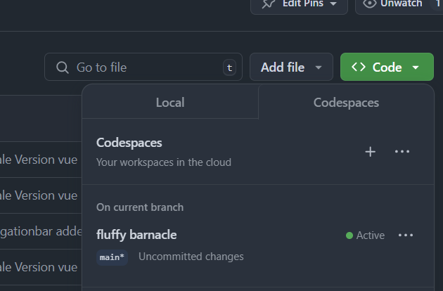

# Sportsy

[](https://github.com/Sybit-Education/bk2wi-2024/actions/workflows/deploy.yml)


Sportsy is a project of the school-class BK2WI 2024/25 at BSZ Radolfzell.
The whole class is structured as start-up company having project management, controlling, marketing, design and software development.

Sportsy will be a platform to find sparring partners for sport training: https://sportsy.netlify.app/

## Development

Please read folowing information carefully to start development.

### Recommended IDE Setup

We use Codespaces of GitHub to run VS Code within the browser:

- Click right hand on the green button `Code` to open dropdown:
  

- Default the tab "Local" is active. Select tab `Codespaces`
- Press the `+` right hand of Codespaces to greate initial codespace
- If you have already a codespace, it is listet below and can be activated and reused.
- opening the codespace it will setup [VSCode](https://code.visualstudio.com/).
- you should install extention [Volar](https://marketplace.visualstudio.com/items?itemName=Vue.volar) for this project.

### Type Support for `.vue` Imports in TS

TypeScript cannot handle type information for `.vue` imports by default, so we replace the `tsc` CLI with `vue-tsc` for type checking. In editors, we need [Volar](https://marketplace.visualstudio.com/items?itemName=Vue.volar) to make the TypeScript language service aware of `.vue` types.

### Project Setup

After cloudspace with VSCode is setup, we have to
install required libraries like `boostrap-vue-next` etc. for the project:

```sh
npm install
```

This has to be called only once or to add an additional library.

**Hint:** All these commands (`npm ...`) are typed in at the window section at the bottom called `Terminal`.

#### Configure environment

Copy file `.env.example` to `.env` and update content.

**⚠️ DO NOT COMMIT SENSITIVE DATA LIKE API-KEY TO REPOSITORY!⚠️**

#### Compile and Hot-Reload for Development

Command to show the current website live:

```sh
npm start
```

#### Type-Check, Compile and Minify for Production

```sh
npm run build
```

#### Lint with [ESLint](https://eslint.org/)

Doing some checks on source code:

```sh
npm run lint
```

### More Information

- [Project Structure](docs/project-structure.md)
